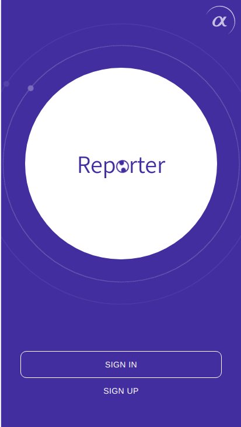

# Reporter


  


  


Mobile PWA for filling up an attendance report.




You can start application (with separated services) using (it will build all files and run current branch):
```bash
docker-compose up --build
```

Or using one public container:
```bash
docker run reporterone/reporter
```
